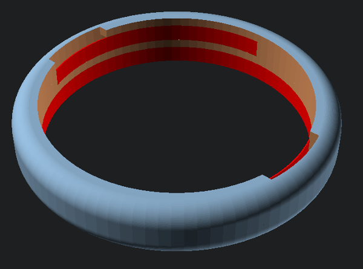
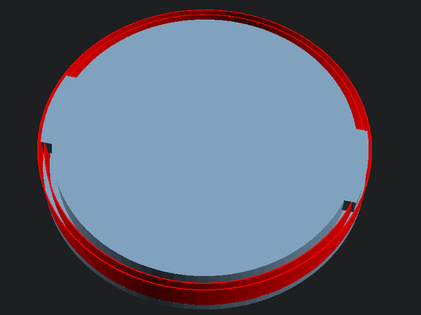

fmp-Capsule
===========

The fmp is a simpler 3D-printable capsule for the
[seidenstrasse](https://events.ccc.de/congress/2015/wiki/Projects:Seidenstrasse) pneumatic tube system.

How to build it
---------------
1. Go to a hardware store of choice
2. Try to get some 2 component epoxy and nuts
	and some plastic tubing with an inner diameter of 70mm (*DN75 HT-Rohr* works fine).
3. Fire up your 3D-Printer and print the lid, top
	and bottom segment of the capsule.
	20-25% Infill works fine and provides enough stability.
4. Remove the support structure (marked red) from lid and top.
	 
5. Clean up the latches on the lid and the channels on the top part.
Make sure the lid fits well (the latches may need to be filed down).
6. Cut about 150mm long piece of tube.
7. Glue top end bottom to the tube piece using 2 component epoxy.
8. Go get some Mate or something, while the epoxy sets...

Suggestions ?
-------------

Try @l_h_hacker on twitter or #seidenstrasse on irc.hackint.org
